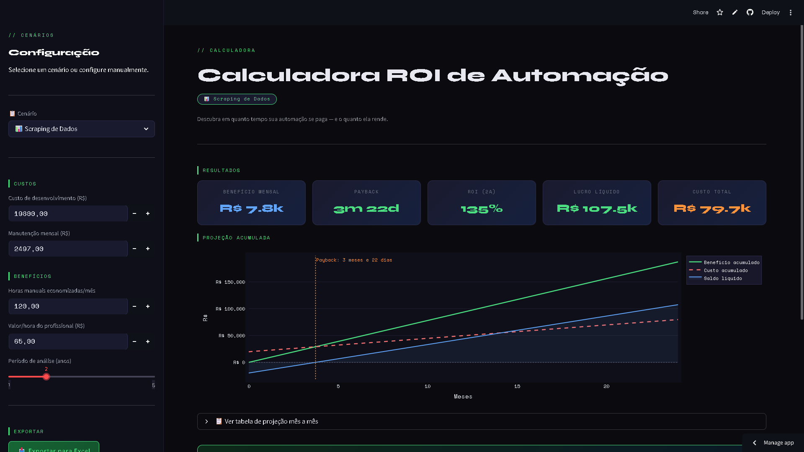

# 🤖 Calculadora de ROI de Automação Python

Aplicação web interativa construída com **Streamlit** para calcular o Retorno sobre Investimento (ROI) de automações desenvolvidas em Python. Interface em tela cheia com tema escuro, menu lateral de cenários pré-definidos e exportação para Excel.

---
## 🖥️ Preview da Interface



## ✨ Funcionalidades

### 📋 Menu Lateral — Cenários Pré-definidos
Selecione um cenário e todos os inputs são preenchidos automaticamente:

| Cenário | Custo Dev | Manutenção | Horas/mês | Valor/hora | Período |
|---|---|---|---|---|---|
| 🎯 Personalizado | — | — | — | — | — |
| 🤖 Automação de Relatórios | R$ 3.000 | R$ 150 | 20h | R$ 60 | 2 anos |
| 📧 Disparo de E-mails | R$ 1.500 | R$ 50 | 15h | R$ 40 | 1 ano |
| 🔄 Integração ETL | R$ 8.000 | R$ 500 | 60h | R$ 80 | 3 anos |
| 📊 Scraping de Dados | R$ 2.500 | R$ 100 | 30h | R$ 55 | 2 anos |
| 🧾 Emissão de NF-e | R$ 5.000 | R$ 200 | 44h | R$ 50 | 3 anos |
| 📁 Organização de Arquivos | R$ 800 | R$ 30 | 8h | R$ 35 | 1 ano |

### 📊 Cards de Resultado (5 métricas)
- **Benefício Mensal** — horas economizadas × valor/hora
- **Payback** — meses para recuperar o investimento
- **ROI** — retorno sobre investimento no período
- **Lucro Líquido** — benefício total menos custo total
- **Custo Total** — desenvolvimento + manutenção acumulada

Valores com cor dinâmica: 🟢 positivo / 🟠 alerta / 🔴 negativo

### 📈 Gráfico Interativo (Plotly)
- Curva de benefício acumulado
- Curva de custo acumulado
- Saldo líquido com área sombreada
- Linha vertical de payback (quando dentro do período)

### 📋 Tabela Expansível
Projeção mês a mês com: custo acumulado, benefício acumulado, saldo líquido e ROI acumulado (%).

### 📥 Exportação para Excel
Gera um `.xlsx` com 2 abas formatadas:

**Aba "Resumo"**
- Parâmetros de entrada (custo de desenvolvimento, manutenção, horas, valor/hora, período)
- Resultados calculados (benefício mensal, custo total, benefício total, lucro líquido, ROI, payback)
- Cores: verde para positivo, vermelho para negativo

**Aba "Projeção Mensal"**
- Tabela mês a mês com custo, benefício, saldo e ROI acumulados
- Cores dinâmicas por valor

---

## 🧮 Fórmulas

| Métrica | Fórmula |
|---|---|
| Benefício Mensal | `horas_mes × valor_hora` |
| Benefício Total | `beneficio_mensal × meses` |
| Custo Total | `custo_dev + (custo_manut × meses)` |
| Lucro Líquido | `beneficio_total − custo_total` |
| Payback | `custo_dev / (beneficio_mensal − custo_manut)` |
| ROI | `((beneficio_total − custo_total) / custo_total) × 100` |

---

## 📁 Estrutura do Projeto

```
roi-automacao/
│
├── roi_automacao.py          # Aplicação principal
├── requirements.txt          # Dependências do projeto
├── README.md                 # Este arquivo
├── .gitignore                # Arquivos ignorados pelo Git
└── .streamlit/
    └── config.toml           # Tema escuro e configurações
```

---

## 🚀 Como Rodar

### 1. Clone ou baixe o projeto
```bash
git clone <url-do-repositorio>
cd roi-automacao
```

### 2. Crie e ative um ambiente virtual
```bash
# Windows
python -m venv venv
venv\Scripts\activate

# Linux / macOS
python -m venv venv
source venv/bin/activate
```

### 3. Instale as dependências
```bash
pip install -r requirements.txt
```

### 4. Execute a aplicação
```bash
streamlit run roi_automacao.py
```

A aplicação abrirá automaticamente em `http://localhost:8501`.

---

## 🛠 Tecnologias

| Biblioteca | Versão | Uso |
|---|---|---|
| [Streamlit](https://streamlit.io/) | ≥ 1.32 | Interface web e sidebar |
| [Plotly](https://plotly.com/python/) | ≥ 5.20 | Gráfico interativo |
| [Pandas](https://pandas.pydata.org/) | ≥ 2.0 | Tabela de projeção |
| [OpenPyXL](https://openpyxl.readthedocs.io/) | ≥ 3.1 | Exportação para Excel |

---

## 🐛 Erros Conhecidos e Soluções

### `ValueError: Invalid column index A`
Causado por passar strings (`"A"`, `"B"`) para `get_column_letter()`, que espera inteiros. Solução: usar as letras diretamente em `column_dimensions[col]`.

```python
# ❌ Errado
ws.column_dimensions[get_column_letter(col)].width = w

# ✅ Correto
ws.column_dimensions[col].width = w
```

---

## 📄 Licença

MIT License — sinta-se livre para usar e modificar.
